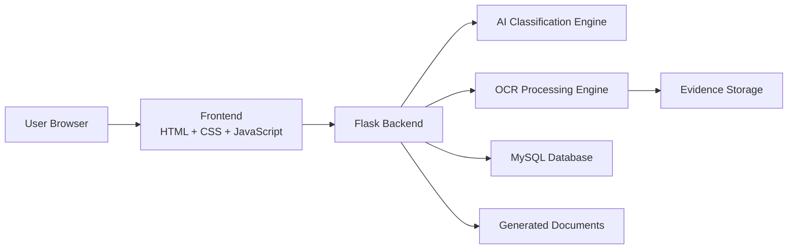
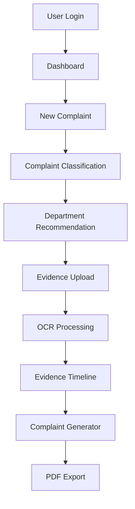
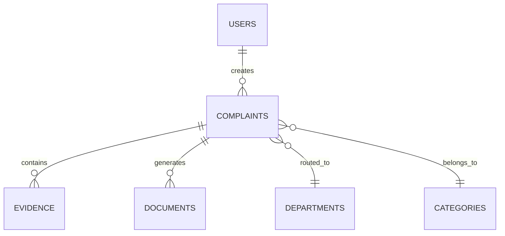
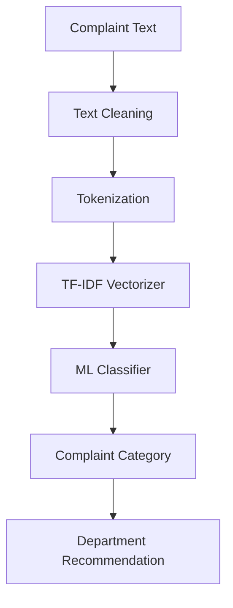
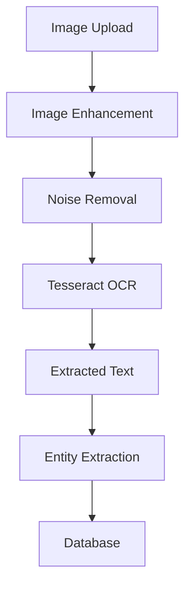
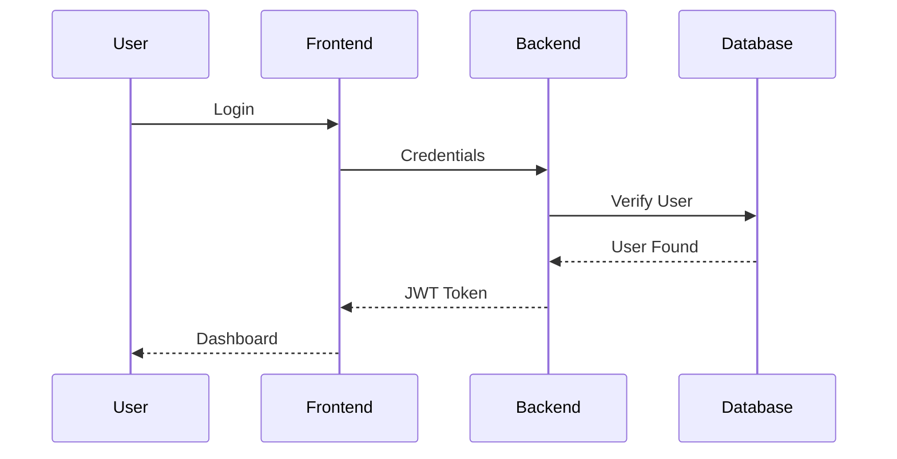
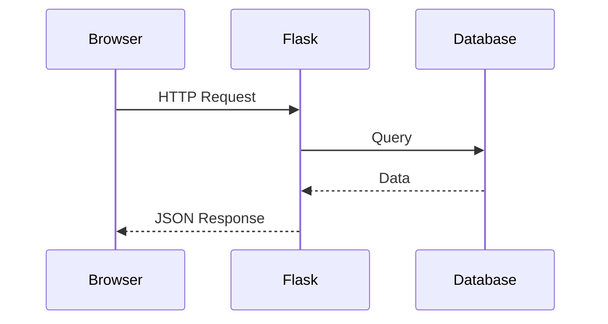
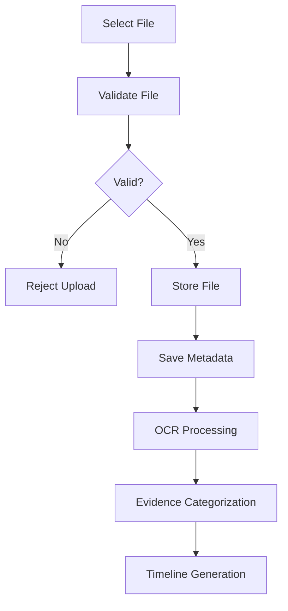
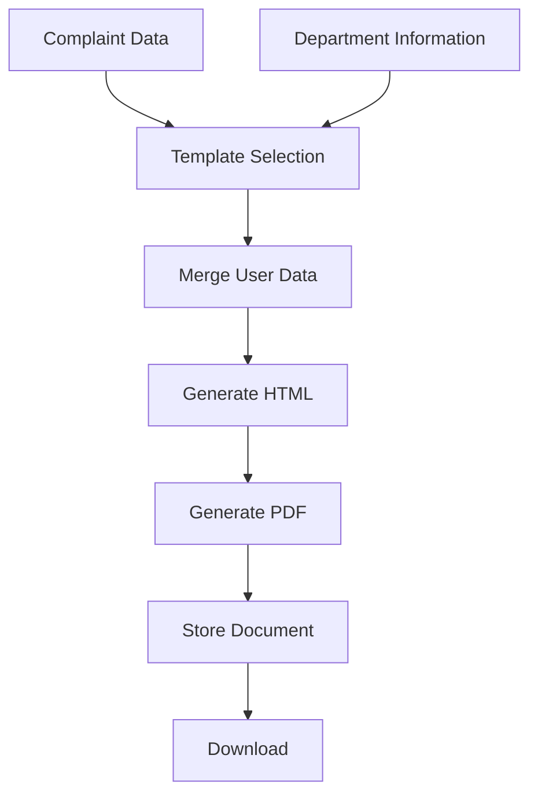

# 02_Technical_Architecture_Document.md

# Judiciary Flow

## Technical Architecture Document

**Version:** 1.0

**Project:** Judiciary Flow

**Document Type:** Technical Architecture

**Technology Stack**

- Python
- Flask
- Flask REST API
- HTML5
- CSS3
- Vanilla JavaScript
- MySQL
- Scikit-learn
- spaCy
- OpenCV
- Tesseract OCR
- ReportLab

**Status:** Draft

---

# Revision History

| Version | Date | Description |
|----------|------|-------------|
| 1.0 | July 2026 | Initial Architecture Document |

---

# Table of Contents

1. Introduction
2. System Overview
3. Architecture Goals
4. High-Level System Architecture
5. System Components
6. Overall Workflow
7. Frontend Architecture
8. Backend Architecture

---

# 1. Introduction

## Purpose

This document describes the complete technical architecture of **Judiciary Flow**.

It acts as the implementation blueprint for developers and AI coding assistants.

The goal is to define how every component communicates, how data flows through the application, and how the system will be built using the approved technology stack.

---

## Scope

This document covers:

- Overall Architecture
- Frontend Design
- Backend Design
- AI Components
- OCR Pipeline
- Authentication
- Database Communication
- API Flow
- Deployment Strategy

---

## Intended Audience

- Developers
- AI Coding Agents
- Hackathon Judges
- Mentors
- Contributors

---

# 2. System Overview

Judiciary Flow is a web application that helps users prepare complaint documents before submitting them to the appropriate government authority.

The application combines traditional web technologies with lightweight AI models to automate complaint classification and evidence organization.

Instead of relying on a large language model for legal drafting, the system uses validated templates and machine learning for reliable, explainable outputs.

---

## Core Modules

The system consists of five primary modules.

1. Authentication Module
2. Complaint Management Module
3. AI Recommendation Engine
4. Evidence Processing Module
5. Document Generation Module

---

# 3. Architecture Goals

The architecture is designed with the following principles.

## Simplicity

Easy to understand and maintain during a hackathon.

---

## Scalability

New complaint categories and document templates should be easy to add.

---

## Modularity

Each module should work independently.

---

## Security

Protect user accounts and uploaded documents.

---

## Maintainability

Code should follow a clean folder structure and coding standards.

---

## Performance

The application should respond quickly even on modest hardware.

---

# 4. High-Level System Architecture



---

## Component Description

### User Browser

Provides the graphical interface for users.

Responsibilities

- Registration
- Login
- Complaint Submission
- File Upload
- Download Documents

---

### Frontend

Built using

- HTML5
- CSS3
- Vanilla JavaScript

Responsibilities

- Form Validation
- User Interaction
- API Communication
- Dashboard Rendering

---

### Flask Backend

Acts as the central application server.

Responsibilities

- Authentication
- API Processing
- Database Operations
- AI Integration
- OCR Integration
- PDF Generation

---

### AI Engine

Responsible for

- Complaint Classification
- Department Recommendation
- Confidence Score

Technology

- Scikit-learn
- TF-IDF

---

### OCR Engine

Responsible for

- Image Enhancement
- Text Extraction

Technology

- OpenCV
- Tesseract OCR

---

### Database

Stores

- Users
- Complaints
- Evidence Metadata
- Departments
- Categories
- Generated Documents

Technology

- MySQL

---

# 5. System Components

## Component 1

Authentication Service

Responsibilities

- Register User
- Login User
- JWT Token Generation
- Logout

---

## Component 2

Complaint Service

Responsibilities

- Save Complaint
- Update Complaint
- Delete Complaint
- Retrieve Complaint

---

## Component 3

AI Service

Responsibilities

- Text Cleaning
- Feature Extraction
- Complaint Classification
- Department Prediction

---

## Component 4

OCR Service

Responsibilities

- Image Preprocessing
- OCR
- Entity Extraction

---

## Component 5

Document Service

Responsibilities

- Template Selection
- PDF Generation
- HTML Export

---

## Component 6

Evidence Service

Responsibilities

- File Upload
- File Validation
- Categorization
- Timeline Creation

---

# 6. Overall Workflow



---

# 7. Frontend Architecture

The frontend is intentionally lightweight.

Frameworks such as React or Angular are not used to keep the project simple and aligned with the selected technology stack.

---

## Frontend Technologies

- HTML5
- CSS3
- Vanilla JavaScript

---

## Main Pages

### Landing Page

Purpose

Introduce the platform and guide users to register or log in.

Components

- Hero Section
- Features
- About
- Login Button
- Register Button

---

### Authentication Pages

Pages

- Login
- Register

Features

- Form Validation
- Password Visibility Toggle
- Error Messages

---

### Dashboard

Displays

- User Profile
- Complaint History
- Create Complaint Button
- Recent Documents
- Uploaded Evidence

---

### Complaint Form

Collects

- Complaint Title
- Description
- State
- District

Actions

- Submit
- Save Draft
- Reset

---

### Evidence Upload

Supports

- Drag and Drop
- Multiple Upload
- File Preview
- Delete

---

### Generated Document Page

Displays

- Complaint Preview
- Download PDF
- Print

---

# 8. Backend Architecture

The backend follows a layered architecture.

```
Client

↓

Routes

↓

Controllers

↓

Services

↓

AI Modules

↓

Database

↓

Response
```

---

## Backend Layers

### Routes

Responsibilities

- Receive HTTP requests
- Validate routes
- Forward requests

Example

```
/auth/login

/auth/register

/complaints

/ocr

/documents
```

---

### Controllers

Responsibilities

- Receive validated request
- Call business logic
- Return response

Controllers should not contain database logic.

---

### Services

Services contain all business logic.

Examples

- Authentication Service
- Complaint Service
- AI Service
- OCR Service
- Document Service

---

### Models

Represent database tables.

Examples

- User
- Complaint
- Evidence
- Department
- Document

---

### Utilities

Reusable helper functions.

Examples

- Date Formatting
- File Validation
- OCR Helpers
- PDF Utilities
- Email Helpers

---

### Middleware

Responsible for

- JWT Verification
- Authentication
- Request Logging
- Error Handling

---

## End of Part 1

**Next:** **Part 2 — Project Folder Structure, Database Architecture, AI Architecture, OCR Pipeline, Authentication Flow, Complaint Processing Flow, and API Communication.**


# Part 2 — Project Folder Structure, Database Architecture, AI Architecture, OCR Pipeline, Authentication Flow & API Communication

---

# 9. Project Folder Structure

The project follows a modular architecture to keep the codebase clean, maintainable, and easy to scale.

```
Judiciary-Flow/
│
├── app.py
├── config.py
├── requirements.txt
├── .env
├── README.md
│
├── backend/
│   ├── routes/
│   │   ├── auth_routes.py
│   │   ├── complaint_routes.py
│   │   ├── ai_routes.py
│   │   ├── evidence_routes.py
│   │   └── document_routes.py
│   │
│   ├── controllers/
│   │   ├── auth_controller.py
│   │   ├── complaint_controller.py
│   │   ├── ai_controller.py
│   │   ├── evidence_controller.py
│   │   └── document_controller.py
│   │
│   ├── services/
│   │   ├── auth_service.py
│   │   ├── complaint_service.py
│   │   ├── ai_service.py
│   │   ├── ocr_service.py
│   │   ├── document_service.py
│   │   └── email_service.py
│   │
│   ├── models/
│   │   ├── user.py
│   │   ├── complaint.py
│   │   ├── department.py
│   │   ├── evidence.py
│   │   └── document.py
│   │
│   ├── middleware/
│   │   ├── auth.py
│   │   ├── jwt.py
│   │   └── logger.py
│   │
│   ├── ai/
│   │   ├── classifier.py
│   │   ├── preprocessing.py
│   │   ├── predictor.py
│   │   └── model.pkl
│   │
│   ├── ocr/
│   │   ├── image_processing.py
│   │   ├── extractor.py
│   │   └── entity_extractor.py
│   │
│   └── utils/
│       ├── validators.py
│       ├── file_handler.py
│       ├── helpers.py
│       └── constants.py
│
├── frontend/
│   ├── templates/
│   ├── css/
│   ├── js/
│   ├── images/
│   └── icons/
│
├── uploads/
│
├── generated_documents/
│
├── datasets/
│
├── database/
│   ├── schema.sql
│   └── seed.sql
│
└── docs/
```

---

# 10. Database Architecture

The application uses a relational database to ensure data consistency and efficient querying.

## Database Modules

```
Users

↓

Complaints

↓

Evidence

↓

Generated Documents

↓

Activity Logs
```

---

## Database Layers

### User Layer

Stores

- Account Details
- Login Credentials
- Profile Information

---

### Complaint Layer

Stores

- Complaint Details
- Complaint Category
- Department
- Status

---

### Evidence Layer

Stores

- Uploaded Files
- OCR Text
- Categories
- Timeline Data

---

### Document Layer

Stores

- Generated PDFs
- Document Metadata

---

### Activity Layer

Stores

- Login History
- Complaint Activity
- File Upload Logs

---

# Entity Relationship Diagram



---

# Database Communication Flow

```
Frontend

↓

Flask API

↓

Service Layer

↓

Models

↓

MySQL

↓

JSON Response
```

---

# 11. AI Architecture

The AI layer is responsible for complaint classification and department recommendation.

---

## AI Workflow



---

## AI Components

### Text Preprocessing

Tasks

- Lowercase Conversion
- Remove Punctuation
- Remove Stop Words
- Remove Extra Spaces

---

### Feature Extraction

Uses

TF-IDF Vectorizer

Converts complaint text into numerical vectors.

---

### Machine Learning Model

Recommended Algorithm

- Logistic Regression

Alternative Models

- Linear SVM
- Random Forest
- Naive Bayes

For the MVP, Logistic Regression offers a good balance of simplicity, speed, and explainability.

---

### Prediction Output

The AI returns:

- Complaint Category
- Confidence Score
- Recommended Department

---

# Complaint Classification Pipeline

```
Complaint

↓

Cleaning

↓

Tokenization

↓

Vectorization

↓

Classification

↓

Recommendation
```

---

# 12. OCR Architecture

OCR extracts text from uploaded evidence.

---

## OCR Workflow



---

## Image Enhancement

OpenCV performs

- Resize
- Grayscale
- Thresholding
- Noise Removal
- Contrast Improvement

---

## OCR Engine

Technology

- Tesseract OCR

Supported Formats

- JPG
- PNG
- JPEG
- PDF

---

## Entity Extraction

Extract

- Dates
- Amounts
- Person Names
- Organization Names
- Addresses

Technology

- spaCy
- Regular Expressions

---

# 13. Authentication Flow

Authentication uses JWT.

---

## Login Flow



---

## Registration Flow

```
User

↓

Registration Form

↓

Validation

↓

Hash Password

↓

Store User

↓

Success
```

---

## Password Security

Passwords are

- Salted
- Hashed using bcrypt
- Never stored in plain text

---

## JWT Flow

```
Login

↓

Generate JWT

↓

Store Token

↓

Protected APIs

↓

Token Validation

↓

Access Granted
```

---

# 14. Complaint Processing Flow

```
Create Complaint

↓

Validate Data

↓

Save Complaint

↓

Run AI

↓

Predict Category

↓

Recommend Department

↓

Upload Evidence

↓

OCR

↓

Timeline

↓

Generate PDF
```

---

# 15. API Communication

The frontend communicates with the backend using REST APIs.

---

## Request Flow



---

## Response Format

Successful Response

```json
{
  "success": true,
  "message": "Complaint classified successfully.",
  "data": {}
}
```

---

Error Response

```json
{
  "success": false,
  "message": "Invalid request.",
  "errors": []
}
```

---

## HTTP Status Codes

| Code | Meaning |
|------|---------|
| 200 | Success |
| 201 | Created |
| 400 | Bad Request |
| 401 | Unauthorized |
| 403 | Forbidden |
| 404 | Not Found |
| 500 | Internal Server Error |

---

# 16. Error Handling Strategy

The system should gracefully handle:

- Invalid input
- Database failures
- OCR failures
- AI prediction failures
- Missing files
- Unauthorized access

Errors are logged on the server while users receive clear, user-friendly messages without exposing internal implementation details.

---

## End of Part 2

**Next:** **Part 3 — File Upload Architecture, Document Generation, Dashboard Architecture, Security Architecture, Deployment Architecture, Coding Standards & Development Workflow.**


# Part 3 — File Upload Architecture, Document Generation, Dashboard Architecture, Security Architecture, Deployment Architecture, Coding Standards & Development Workflow

---

# 17. File Upload Architecture

The Evidence Upload module is responsible for securely accepting user files, validating them, storing them, and sending supported files for OCR processing.

---

## Upload Workflow



---

## Supported File Types

| Category | Extensions |
|-----------|------------|
| Images | JPG, JPEG, PNG |
| Documents | PDF |
| Audio | MP3, WAV |

---

## File Size Limit

Maximum upload size

```
20 MB per file
```

Maximum number of files

```
10 Files per Complaint
```

---

## Upload Validation

Before storing a file, the backend validates:

- File extension
- MIME type
- File size
- Duplicate filename
- Virus check (Future)

---

## Upload Directory Structure

```
uploads/

├── images/
├── pdfs/
├── audio/
└── temp/
```

---

## Stored Metadata

Each uploaded file stores

- File ID
- Complaint ID
- Original Filename
- Stored Filename
- File Type
- Upload Time
- OCR Status
- Category

---

# 18. Document Generation Architecture

The Document Generator creates professional complaint documents using predefined templates.

---

## Why Template-Based?

Advantages

- Consistent formatting
- Faster generation
- Easier maintenance
- Reduced risk of incorrect legal wording
- Predictable output

---

## Document Generation Workflow



---

## PDF Structure

Every generated complaint includes:

- Header
- User Information
- Authority Details
- Subject
- Complaint Body
- Requested Relief
- Evidence Summary
- Signature Area
- Date

---

## Technologies

- ReportLab
- python-docx
- Jinja2 Templates

---

## Generated Documents Folder

```
generated_documents/

├── pdf/
├── html/
└── docx/
```

---

# 19. Dashboard Architecture

The Dashboard acts as the central workspace.

---

## Dashboard Components

```text
Dashboard

├── User Profile
├── Statistics
├── Complaint History
├── Recent Documents
├── Uploaded Evidence
├── Notifications
└── Quick Actions
```

---

## Dashboard Widgets

### User Profile

Displays

- Name
- Email
- Last Login

---

### Complaint Summary

Displays

- Total Complaints
- Draft Complaints
- Completed Complaints
- Generated Documents

---

### Quick Actions

Buttons

- New Complaint
- Upload Evidence
- Generate Complaint
- View Documents

---

### Recent Activity

Displays

- Recent Complaints
- Uploaded Files
- Generated PDFs

---

# 20. Security Architecture

Security is implemented across every layer.

---

## Security Layers

```mermaid
flowchart TD

Client

↓

Authentication

↓

Authorization

↓

Validation

↓

Business Logic

↓

Database

↓

Logging
```

---

## Authentication

Technology

- JWT

---

## Password Security

Algorithm

```
bcrypt
```

Passwords

- Salted
- Hashed
- Never Stored Plain Text

---

## Authorization

Users may access only:

- Their profile
- Their complaints
- Their evidence
- Their documents

---

## Input Validation

Validate

- Emails
- Passwords
- Complaint Text
- Uploaded Files

---

## SQL Injection Protection

Use

- Parameterized Queries
- Prepared Statements

Never concatenate SQL strings directly.

---

## XSS Protection

- Escape HTML
- Validate Input
- Sanitize User Content

---

## CSRF Protection

- CSRF Tokens
- SameSite Cookies

---

## Secure Headers

Recommended Headers

```
Content-Security-Policy

X-Frame-Options

X-Content-Type-Options

Strict-Transport-Security
```

---

## Logging

Log

- Login Attempts
- Failed Authentication
- File Uploads
- Errors
- AI Predictions

---

# 21. Deployment Architecture

The application is designed for cloud deployment.

---

## Production Architecture

```mermaid
flowchart LR

User

↓

Netlify

↓

Flask Backend

↓

MySQL Database

↓

File Storage
```

---

## Deployment Components

### Frontend

Hosting

Netlify

---

### Backend

Hosting

Render

Alternative

Railway

---

### Database

MySQL

---

### File Storage

Initially

```
Local Storage
```

Future

```
Cloud Storage
```

---

## Environment Variables

```
SECRET_KEY

JWT_SECRET_KEY

MYSQL_HOST

MYSQL_USER

MYSQL_PASSWORD

MYSQL_DB

MAIL_USERNAME

MAIL_PASSWORD
```

---

# 22. Coding Standards

The project follows consistent coding conventions.

---

## Python

- PEP 8
- Meaningful Variable Names
- Modular Functions
- Type Hints (Recommended)

---

## HTML

- Semantic Elements
- Accessible Forms
- Mobile First

---

## CSS

- Component-Based Structure
- Responsive Design
- Reusable Utility Classes

---

## JavaScript

- ES6+
- Modular Code
- Async/Await
- Fetch API

---

## API Standards

Every API should return

```json
{
  "success": true,
  "message": "",
  "data": {}
}
```

---

## Naming Conventions

### Files

```
snake_case.py
```

---

### Classes

```
PascalCase
```

---

### Variables

```
snake_case
```

---

### Database Tables

```
snake_case
```

---

### API Endpoints

```
/api/v1/resource
```

---

# 23. Development Workflow

Development follows an incremental approach.

---

## Phase 1

Project Setup

- Repository
- Flask
- Database
- Authentication

---

## Phase 2

Complaint Module

- Complaint Form
- Dashboard
- CRUD Operations

---

## Phase 3

AI Module

- Classification
- Recommendation

---

## Phase 4

Evidence Module

- Upload
- OCR
- Categorization

---

## Phase 5

Document Generator

- Templates
- PDF Export

---

## Phase 6

Testing

- Unit Testing
- Integration Testing
- Manual Testing

---

## Phase 7

Deployment

- Backend
- Frontend
- Database

---

## Recommended Git Workflow

```text
main

│

├── develop

│

├── feature/authentication

├── feature/complaint-module

├── feature/ai-classifier

├── feature/evidence-upload

├── feature/document-generator

└── feature/dashboard
```

---

# 24. Performance Guidelines

| Module | Target |
|----------|---------|
| Login | <1 sec |
| Dashboard | <2 sec |
| AI Prediction | <2 sec |
| OCR | <5 sec |
| PDF Generation | <3 sec |
| Upload | <5 sec |

---

# 25. Best Practices

- Keep controllers lightweight.
- Place business logic in service classes.
- Validate data on both client and server.
- Use reusable templates for document generation.
- Log important events and errors.
- Avoid hard-coded values; use configuration files and environment variables.
- Write modular, testable code.

---

## End of Part 3

**Next:** **Part 4 — Future Scalability, Architecture Decisions, Design Trade-offs, Technical Risks, Monitoring Strategy, Architecture Checklist, and Conclusion.**


# Part 4 — Future Scalability, Architecture Decisions, Technical Risks, Monitoring Strategy, Architecture Checklist & Conclusion

---

# 26. Future Scalability

Although Judiciary Flow is designed as a Hackathon MVP, the architecture is modular and can be extended without major changes.

---

## Planned Scalability

### Multi-language Support

Future versions can support:

- Hindi
- Tamil
- Telugu
- Kannada
- Marathi
- Bengali

Implementation

- Translation JSON files
- Language middleware
- Localized templates

---

### Additional Complaint Categories

Current MVP supports limited categories.

Future categories include:

- Tax Complaints
- Pension Issues
- Passport Services
- Railway Complaints
- Medical Negligence
- Environmental Complaints
- Education Complaints

---

### AI Model Improvements

Current

```
TF-IDF
+
Logistic Regression
```

Future

- Sentence Transformers
- BERT
- Domain-specific Legal NLP
- Hybrid Rule + ML Classification

---

### Government Portal Integration

Potential integrations

- CPGRAMS
- National Consumer Helpline
- DigiLocker
- eCourts
- UMANG
- Cyber Crime Portal

Current MVP intentionally avoids direct integration to reduce complexity and dependency.

---

### Mobile Application

Future versions can include

- Android App
- iOS App

using the same Flask backend APIs.

---

### Admin Dashboard

Admin capabilities

- User Management
- Complaint Analytics
- AI Model Monitoring
- Dataset Management
- Template Management

---

### Cloud Storage

Current

```
Local Storage
```

Future

```
AWS S3

Azure Blob

Google Cloud Storage
```

---

# 27. Architecture Decisions

The following design decisions were made to keep the project practical, maintainable, and suitable for a hackathon.

---

## Decision 1

### Flask Instead of Django

Reason

- Lightweight
- Easier to understand
- Faster development
- Greater flexibility

---

## Decision 2

### MySQL Instead of NoSQL

Reason

- Structured data
- Strong relationships
- Easier reporting
- ACID compliance

---

## Decision 3

### Template-Based Complaint Generation

Reason

- Consistent output
- Easier maintenance
- Predictable formatting
- Reduces incorrect legal wording

---

## Decision 4

### Traditional Machine Learning Instead of Large Language Models

Reason

- Faster inference
- Lower hardware requirements
- Easier evaluation
- Better explainability
- Reliable within hackathon constraints

---

## Decision 5

### REST API Architecture

Reason

- Simple
- Well documented
- Easy frontend integration
- Future mobile compatibility

---

## Decision 6

### Modular Folder Structure

Benefits

- Better organization
- Easier debugging
- Independent modules
- Simpler maintenance

---

# 28. Technical Risks

---

## AI Misclassification

Risk

Incorrect complaint category prediction.

Impact

Medium

Mitigation

- Confidence score
- Manual category selection
- Continuous dataset improvement

---

## OCR Failure

Risk

Poor image quality.

Impact

Medium

Mitigation

- Image preprocessing
- Manual text editing
- User feedback

---

## Large File Uploads

Risk

Slow response time.

Impact

Medium

Mitigation

- File size limit
- Compression
- Validation

---

## Database Failure

Risk

Loss of service.

Mitigation

- Regular backups
- Transaction management
- Error handling

---

## Authentication Attacks

Risk

Unauthorized access.

Mitigation

- JWT expiration
- Strong passwords
- bcrypt hashing
- Rate limiting (Future)

---

# 29. Monitoring Strategy

The system should monitor important events for debugging and performance analysis.

---

## Application Logs

Capture

- User Login
- User Logout
- Complaint Creation
- Complaint Update
- Evidence Upload
- OCR Processing
- AI Classification
- PDF Generation

---

## Error Logs

Capture

- API Errors
- Database Errors
- OCR Failures
- Authentication Failures
- File Upload Errors

---

## Performance Metrics

Monitor

- API Response Time
- Database Query Time
- OCR Processing Time
- AI Prediction Time
- PDF Generation Time

---

## Health Monitoring

Check

- Database Connection
- Flask Server Status
- Disk Usage
- Upload Directory Availability

---

# 30. Architecture Checklist

## Backend

- Flask Project Structure
- REST API
- JWT Authentication
- Modular Services
- Error Handling

Status

☐ Planned

---

## Database

- Normalized Schema
- Foreign Keys
- Indexes
- Constraints

Status

☐ Planned

---

## AI Module

- Complaint Classification
- Recommendation Engine
- Confidence Score

Status

☐ Planned

---

## OCR Module

- Image Enhancement
- OCR Extraction
- Entity Recognition

Status

☐ Planned

---

## Document Generator

- HTML Template
- PDF Generation
- Download API

Status

☐ Planned

---

## Frontend

- Responsive UI
- Dashboard
- Forms
- Validation

Status

☐ Planned

---

## Security

- JWT
- bcrypt
- Input Validation
- Secure Uploads

Status

☐ Planned

---

## Testing

- Unit Testing
- Integration Testing
- Manual Testing

Status

☐ Planned

---

# 31. Recommended Development Order

To maximize efficiency during the hackathon, implement the project in the following sequence:

### Phase 1

Project Setup

- Git Repository
- Flask Configuration
- MySQL Connection
- Environment Variables

---

### Phase 2

Authentication Module

- Registration
- Login
- JWT
- User Dashboard

---

### Phase 3

Complaint Management

- Complaint Form
- CRUD Operations
- Complaint History

---

### Phase 4

AI Module

- Data Preprocessing
- TF-IDF Vectorizer
- Classification Model
- Department Recommendation

---

### Phase 5

Evidence Module

- File Upload
- OCR Processing
- Entity Extraction
- Timeline Generation

---

### Phase 6

Document Generator

- Complaint Templates
- PDF Generation
- Download Functionality

---

### Phase 7

Testing & Deployment

- Functional Testing
- Security Testing
- Performance Optimization
- Deploy to Render/Netlify

---

# 32. Technology Summary

| Layer | Technology |
|--------|------------|
| Frontend | HTML5, CSS3, JavaScript |
| Backend | Python, Flask |
| Database | MySQL |
| Authentication | JWT, bcrypt |
| AI | Scikit-learn, TF-IDF |
| NLP | spaCy, Regex |
| OCR | OpenCV, Tesseract |
| Documents | ReportLab, python-docx |
| Version Control | Git, GitHub |
| Deployment | Render, Netlify |

---

# 33. Conclusion

The architecture of **Judiciary Flow** is designed to be modular, secure, and practical for a hackathon MVP. By combining a lightweight Flask backend, a MySQL database, traditional machine learning for complaint classification, OCR for evidence extraction, and template-based document generation, the system delivers a complete end-to-end workflow while remaining feasible to implement within the project timeline.

The architecture also provides a strong foundation for future enhancements such as multilingual support, government portal integration, mobile applications, and more advanced AI models.

---

# Document Summary

**Document Name:** 02_Technical_Architecture_Document.md

**Version:** 1.0

**Status:** Complete

**Purpose:** Defines the technical blueprint, implementation strategy, system components, workflows, and architecture decisions for Judiciary Flow.

---

**End of Technical Architecture Document**