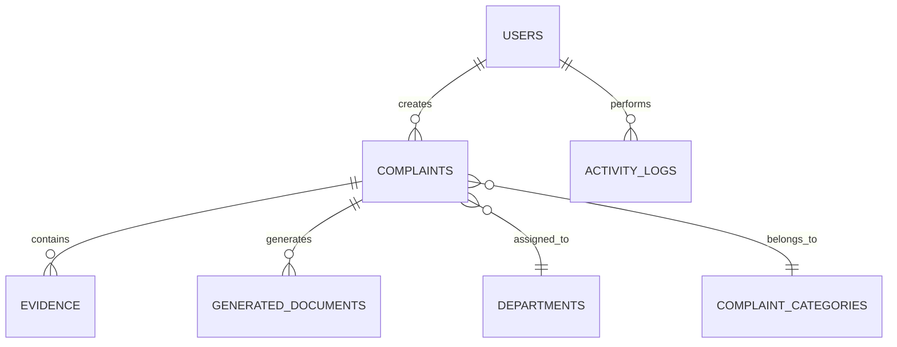
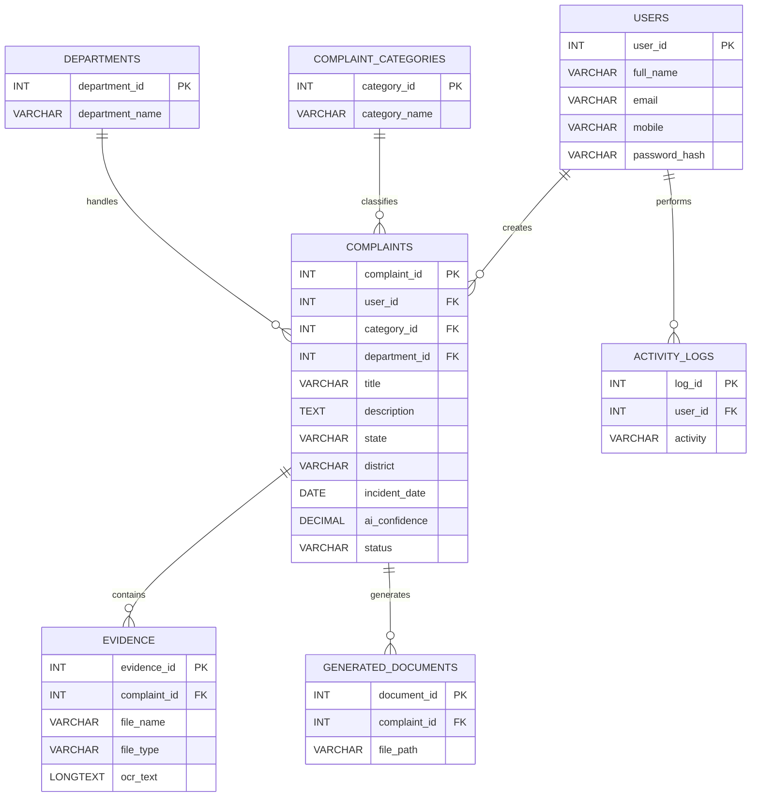

# 06_Database_Design.md

# Judiciary Flow

## Database Design Document

**Version:** 1.0

**Project:** Judiciary Flow

**Document Type:** Database Design Document

**Database:** MySQL 8.x

**Tools**

- MySQL
- MySQL Workbench

**Status:** Draft

---

# Revision History

| Version | Date | Description |
|----------|------|-------------|
| 1.0 | July 2026 | Initial Database Design |

---

# Table of Contents

1. Introduction
2. Database Objectives
3. Database Architecture
4. Database Design Principles
5. Naming Conventions
6. High-Level Database Architecture
7. Entity Relationship Diagram
8. Database Relationships
9. Entity Overview

---

# 1. Introduction

## Purpose

This document defines the complete database architecture for **Judiciary Flow**.

It provides a structured blueprint for storing and managing all application data, ensuring consistency, security, and scalability while supporting the hackathon MVP.

The database is designed to:

- Store user information securely
- Manage complaints
- Store evidence metadata
- Generate complaint documents
- Support AI predictions
- Maintain activity logs

---

## Scope

This document covers:

- Database Architecture
- Table Relationships
- Primary Keys
- Foreign Keys
- Constraints
- Indexes
- SQL Design
- Performance Considerations
- Scalability

---

## Intended Audience

- Backend Developers
- Database Engineers
- AI Developers
- Hackathon Judges
- Future Contributors

---

# 2. Database Objectives

The Judiciary Flow database has the following objectives.

---

## Reliability

Maintain consistent and accurate data.

---

## Security

Protect sensitive user information using proper constraints and access controls.

---

## Performance

Provide fast retrieval for:

- Complaint History
- AI Predictions
- Uploaded Evidence
- Generated Documents

---

## Scalability

Allow future expansion without redesigning the schema.

---

## Maintainability

Keep tables normalized and easy to understand.

---

# 3. Database Architecture

The application uses a **Relational Database Management System (RDBMS)**.

Technology

```
MySQL 8.x
```

---

## Why MySQL?

Advantages

- Open Source
- ACID Compliant
- Strong Relationships
- Easy Backup
- Fast Queries
- Mature Ecosystem
- Excellent Flask Support

---

## Database Flow

```mermaid
flowchart LR

Frontend

↓

Flask API

↓

Service Layer

↓

MySQL Database

↓

JSON Response
```

---

# 4. Database Design Principles

The schema follows these principles.

---

## First Normal Form (1NF)

- No repeating groups
- Atomic values

---

## Second Normal Form (2NF)

- Remove partial dependencies
- Separate lookup tables

---

## Third Normal Form (3NF)

- Remove transitive dependencies
- Reduce duplication

---

## Benefits

- Less redundancy
- Easier updates
- Better integrity
- Better scalability

---

# 5. Naming Conventions

## Database Name

```
judiciary_flow
```

---

## Table Naming

Use

```
snake_case
```

Example

```
users

complaints

evidence

generated_documents
```

---

## Column Naming

Examples

```
user_id

complaint_id

created_at

updated_at
```

---

## Primary Keys

Convention

```
table_name_id
```

Example

```
user_id

department_id

category_id
```

---

## Foreign Keys

Use referenced table name.

Example

```
user_id

complaint_id

department_id
```

---

# 6. High-Level Database Architecture

```mermaid
flowchart TD

Users

↓

Complaints

↓

Evidence

↓

OCR Data

↓

Generated Documents

↓

Activity Logs
```

---

## Core Modules

### User Module

Stores

- Registration
- Login
- Profile

---

### Complaint Module

Stores

- Complaint Information
- AI Classification
- Status
- Department

---

### Evidence Module

Stores

- Uploaded Files
- OCR Metadata
- File Categories

---

### Document Module

Stores

- Generated PDFs
- Download History

---

### Logging Module

Stores

- User Activity
- Login History
- System Logs

---

# 7. Entity Relationship Diagram (ERD)



---

# 8. Database Relationships

## One User

Can create

```
Many Complaints
```

Relationship

```
1 : N
```

---

## One Complaint

Can have

```
Many Evidence Files
```

Relationship

```
1 : N
```

---

## One Complaint

Can generate

```
Many Documents
```

Relationship

```
1 : N
```

---

## One Department

Can receive

```
Many Complaints
```

Relationship

```
1 : N
```

---

## One Category

Can classify

```
Many Complaints
```

Relationship

```
1 : N
```

---

## One User

Can perform

```
Many Activities
```

Relationship

```
1 : N
```

---

# 9. Entity Overview

---

## USERS

Purpose

Stores registered user information.

Main Data

- Profile
- Credentials
- Contact Information

---

## COMPLAINTS

Purpose

Stores complaint details submitted by users.

Main Data

- Title
- Description
- Status
- AI Prediction
- Department

---

## COMPLAINT_CATEGORIES

Purpose

Stores predefined complaint categories.

Examples

- Consumer
- Labour
- Banking
- Property
- Cyber Crime

---

## DEPARTMENTS

Purpose

Stores government departments responsible for handling complaints.

Examples

- Consumer Commission
- Labour Department
- Cyber Crime Cell
- Municipal Corporation
- Police Department

---

## EVIDENCE

Purpose

Stores uploaded file metadata.

Examples

- Images
- PDFs
- Audio

---

## GENERATED_DOCUMENTS

Purpose

Stores generated complaint documents.

Examples

- PDF Path
- HTML Version
- Generation Date

---

## ACTIVITY_LOGS

Purpose

Maintains an audit trail of important user actions.

Examples

- Login
- Complaint Created
- Upload Completed
- PDF Generated

---

# 10. Data Flow Overview

```text
User Registers

↓

User Creates Complaint

↓

Complaint Saved

↓

AI Classification

↓

Department Assigned

↓

Evidence Uploaded

↓

OCR Extracts Text

↓

Complaint PDF Generated

↓

Activity Logged
```

---

# Database Design Decisions

| Decision | Reason |
|----------|--------|
| MySQL | Stable relational database with strong tooling |
| 3NF Normalization | Reduce redundancy and improve consistency |
| Separate Lookup Tables | Easier maintenance and future expansion |
| Foreign Keys | Maintain referential integrity |
| Activity Logs | Support auditing and debugging |
| Metadata-Based File Storage | Avoid storing large files in the database |

---

## End of Part 1

**Next:** **Part 2 — Detailed Table Design (Users, Complaints, Categories, Departments, Evidence, Generated Documents, Activity Logs) with complete column definitions, data types, constraints, and relationships.**

# Part 2 — Detailed Table Design

---

# 11. Table Design Overview

The Judiciary Flow database consists of seven primary tables.

| Table Name | Purpose |
|------------|----------|
| users | Store registered users |
| complaints | Store complaint information |
| complaint_categories | Store complaint categories |
| departments | Store government departments |
| evidence | Store uploaded evidence metadata |
| generated_documents | Store generated complaint documents |
| activity_logs | Store user activities |

---

# 12. USERS Table

## Purpose

Stores all registered users.

---

## Table Name

```
users
```

---

## Columns

| Column | Type | Constraints |
|---------|------|-------------|
| user_id | INT | PK, AUTO_INCREMENT |
| full_name | VARCHAR(100) | NOT NULL |
| email | VARCHAR(150) | UNIQUE, NOT NULL |
| mobile | VARCHAR(15) | UNIQUE, NOT NULL |
| password_hash | VARCHAR(255) | NOT NULL |
| role | ENUM('citizen','admin') | DEFAULT 'citizen' |
| is_active | BOOLEAN | DEFAULT TRUE |
| created_at | TIMESTAMP | DEFAULT CURRENT_TIMESTAMP |
| updated_at | TIMESTAMP | DEFAULT CURRENT_TIMESTAMP ON UPDATE CURRENT_TIMESTAMP |

---

## Primary Key

```
user_id
```

---

## Indexes

- email
- mobile

---

## Relationships

```
users

1

↓

Many

complaints
```

---

# 13. COMPLAINT_CATEGORIES Table

## Purpose

Stores predefined complaint categories.

---

## Table Name

```
complaint_categories
```

---

## Columns

| Column | Type | Constraints |
|---------|------|-------------|
| category_id | INT | PK, AUTO_INCREMENT |
| category_name | VARCHAR(100) | UNIQUE |
| description | TEXT | NULL |

---

## Sample Data

| Category |
|----------|
| Consumer Complaint |
| Labour Complaint |
| Banking Complaint |
| Cyber Crime |
| Property Dispute |
| RTI |
| Municipal Complaint |
| Insurance Complaint |
| Women's Safety |
| Tenant Dispute |

---

# 14. DEPARTMENTS Table

## Purpose

Stores government departments recommended by the AI.

---

## Table Name

```
departments
```

---

## Columns

| Column | Type | Constraints |
|---------|------|-------------|
| department_id | INT | PK |
| department_name | VARCHAR(150) | NOT NULL |
| description | TEXT | NULL |
| website | VARCHAR(255) | NULL |
| helpline | VARCHAR(20) | NULL |
| email | VARCHAR(150) | NULL |

---

## Example Records

| Department |
|------------|
| Consumer Commission |
| Labour Department |
| Cyber Crime Cell |
| Municipal Corporation |
| Police Department |
| Women Helpline |
| Banking Ombudsman |

---

# 15. COMPLAINTS Table

## Purpose

Stores complaint information submitted by users.

---

## Table Name

```
complaints
```

---

## Columns

| Column | Type | Constraints |
|---------|------|-------------|
| complaint_id | INT | PK |
| user_id | INT | FK |
| category_id | INT | FK |
| department_id | INT | FK |
| title | VARCHAR(200) | NOT NULL |
| description | TEXT | NOT NULL |
| state | VARCHAR(100) | NOT NULL |
| district | VARCHAR(100) | NOT NULL |
| incident_date | DATE | NULL |
| ai_confidence | DECIMAL(5,2) | NULL |
| status | ENUM('Draft','Processing','Completed') | DEFAULT 'Draft' |
| created_at | TIMESTAMP | DEFAULT CURRENT_TIMESTAMP |
| updated_at | TIMESTAMP | DEFAULT CURRENT_TIMESTAMP |

---

## Foreign Keys

```
user_id

↓

users.user_id
```

```
category_id

↓

complaint_categories.category_id
```

```
department_id

↓

departments.department_id
```

---

## Relationships

```
Complaint

↓

Many Evidence

↓

Many Documents
```

---

# 16. EVIDENCE Table

## Purpose

Stores uploaded evidence metadata.

---

## Table Name

```
evidence
```

---

## Columns

| Column | Type | Constraints |
|---------|------|-------------|
| evidence_id | INT | PK |
| complaint_id | INT | FK |
| file_name | VARCHAR(255) | NOT NULL |
| original_name | VARCHAR(255) | NOT NULL |
| file_type | VARCHAR(50) | NOT NULL |
| file_size | BIGINT | NOT NULL |
| file_path | VARCHAR(255) | NOT NULL |
| ocr_text | LONGTEXT | NULL |
| category | VARCHAR(100) | NULL |
| upload_time | TIMESTAMP | DEFAULT CURRENT_TIMESTAMP |

---

## Supported File Types

- JPG
- PNG
- JPEG
- PDF
- MP3
- WAV

---

## Relationship

```
Complaint

↓

Evidence
```

---

# 17. GENERATED_DOCUMENTS Table

## Purpose

Stores generated complaint documents.

---

## Table Name

```
generated_documents
```

---

## Columns

| Column | Type | Constraints |
|---------|------|-------------|
| document_id | INT | PK |
| complaint_id | INT | FK |
| document_type | ENUM('PDF','HTML','DOCX') | DEFAULT 'PDF' |
| file_path | VARCHAR(255) | NOT NULL |
| generated_at | TIMESTAMP | DEFAULT CURRENT_TIMESTAMP |

---

## Relationship

```
Complaint

↓

Generated Documents
```

---

# 18. ACTIVITY_LOGS Table

## Purpose

Stores important user activities for auditing.

---

## Table Name

```
activity_logs
```

---

## Columns

| Column | Type | Constraints |
|---------|------|-------------|
| log_id | INT | PK |
| user_id | INT | FK |
| activity | VARCHAR(255) | NOT NULL |
| ip_address | VARCHAR(45) | NULL |
| user_agent | VARCHAR(255) | NULL |
| created_at | TIMESTAMP | DEFAULT CURRENT_TIMESTAMP |

---

## Sample Activities

- User Login
- User Logout
- Complaint Created
- Complaint Updated
- Evidence Uploaded
- OCR Completed
- PDF Generated

---

# 19. Complete Relationship Summary

| Parent Table | Child Table | Relationship |
|---------------|------------|--------------|
| users | complaints | 1 : N |
| users | activity_logs | 1 : N |
| complaint_categories | complaints | 1 : N |
| departments | complaints | 1 : N |
| complaints | evidence | 1 : N |
| complaints | generated_documents | 1 : N |

---

# 20. Complete ER Diagram



---

## End of Part 2

**Next:** **Part 3 — Complete MySQL SQL Schema (CREATE TABLE statements), Primary Keys, Foreign Keys, Indexes, Constraints, Views, Stored Procedures, Triggers, and Sample Queries.**


# Part 3 — Complete SQL Schema, Keys, Constraints, Indexes, Views & Sample Queries

---

# 21. Complete Database Schema

Database Name

```sql
CREATE DATABASE judiciary_flow;

USE judiciary_flow;
```

---

# 22. Users Table

```sql
CREATE TABLE users (

    user_id INT AUTO_INCREMENT PRIMARY KEY,

    full_name VARCHAR(100) NOT NULL,

    email VARCHAR(150) NOT NULL UNIQUE,

    mobile VARCHAR(15) NOT NULL UNIQUE,

    password_hash VARCHAR(255) NOT NULL,

    role ENUM('citizen','admin') DEFAULT 'citizen',

    is_active BOOLEAN DEFAULT TRUE,

    created_at TIMESTAMP DEFAULT CURRENT_TIMESTAMP,

    updated_at TIMESTAMP DEFAULT CURRENT_TIMESTAMP
    ON UPDATE CURRENT_TIMESTAMP

);
```

---

# 23. Complaint Categories Table

```sql
CREATE TABLE complaint_categories (

    category_id INT AUTO_INCREMENT PRIMARY KEY,

    category_name VARCHAR(100) UNIQUE NOT NULL,

    description TEXT

);
```

---

# 24. Departments Table

```sql
CREATE TABLE departments (

    department_id INT AUTO_INCREMENT PRIMARY KEY,

    department_name VARCHAR(150) NOT NULL,

    description TEXT,

    website VARCHAR(255),

    helpline VARCHAR(20),

    email VARCHAR(150)

);
```

---

# 25. Complaints Table

```sql
CREATE TABLE complaints (

    complaint_id INT AUTO_INCREMENT PRIMARY KEY,

    user_id INT NOT NULL,

    category_id INT,

    department_id INT,

    title VARCHAR(200) NOT NULL,

    description TEXT NOT NULL,

    state VARCHAR(100) NOT NULL,

    district VARCHAR(100) NOT NULL,

    incident_date DATE,

    ai_confidence DECIMAL(5,2),

    status ENUM(
        'Draft',
        'Processing',
        'Completed'
    ) DEFAULT 'Draft',

    created_at TIMESTAMP DEFAULT CURRENT_TIMESTAMP,

    updated_at TIMESTAMP DEFAULT CURRENT_TIMESTAMP
    ON UPDATE CURRENT_TIMESTAMP,

    FOREIGN KEY(user_id)
        REFERENCES users(user_id),

    FOREIGN KEY(category_id)
        REFERENCES complaint_categories(category_id),

    FOREIGN KEY(department_id)
        REFERENCES departments(department_id)

);
```

---

# 26. Evidence Table

```sql
CREATE TABLE evidence (

    evidence_id INT AUTO_INCREMENT PRIMARY KEY,

    complaint_id INT NOT NULL,

    file_name VARCHAR(255) NOT NULL,

    original_name VARCHAR(255),

    file_type VARCHAR(50),

    file_size BIGINT,

    file_path VARCHAR(255),

    ocr_text LONGTEXT,

    category VARCHAR(100),

    upload_time TIMESTAMP DEFAULT CURRENT_TIMESTAMP,

    FOREIGN KEY(complaint_id)
        REFERENCES complaints(complaint_id)

);
```

---

# 27. Generated Documents Table

```sql
CREATE TABLE generated_documents (

    document_id INT AUTO_INCREMENT PRIMARY KEY,

    complaint_id INT NOT NULL,

    document_type ENUM(
        'PDF',
        'HTML',
        'DOCX'
    ) DEFAULT 'PDF',

    file_path VARCHAR(255),

    generated_at TIMESTAMP DEFAULT CURRENT_TIMESTAMP,

    FOREIGN KEY(complaint_id)
        REFERENCES complaints(complaint_id)

);
```

---

# 28. Activity Logs Table

```sql
CREATE TABLE activity_logs (

    log_id INT AUTO_INCREMENT PRIMARY KEY,

    user_id INT NOT NULL,

    activity VARCHAR(255),

    ip_address VARCHAR(45),

    user_agent VARCHAR(255),

    created_at TIMESTAMP DEFAULT CURRENT_TIMESTAMP,

    FOREIGN KEY(user_id)
        REFERENCES users(user_id)

);
```

---

# 29. Primary Keys

| Table | Primary Key |
|---------|-------------|
| users | user_id |
| complaints | complaint_id |
| complaint_categories | category_id |
| departments | department_id |
| evidence | evidence_id |
| generated_documents | document_id |
| activity_logs | log_id |

---

# 30. Foreign Keys

| Child Table | Parent Table |
|--------------|--------------|
| complaints.user_id | users.user_id |
| complaints.category_id | complaint_categories.category_id |
| complaints.department_id | departments.department_id |
| evidence.complaint_id | complaints.complaint_id |
| generated_documents.complaint_id | complaints.complaint_id |
| activity_logs.user_id | users.user_id |

---

# 31. Database Constraints

## Unique Constraints

```sql
email UNIQUE

mobile UNIQUE

category_name UNIQUE
```

---

## NOT NULL Constraints

Applied on

- Name
- Email
- Password
- Complaint Title
- Complaint Description
- State
- District

---

## Default Values

Examples

```sql
role = citizen

status = Draft

created_at = CURRENT_TIMESTAMP
```

---

# 32. Database Indexes

## User Index

```sql
CREATE INDEX idx_users_email

ON users(email);
```

---

## Complaint Status

```sql
CREATE INDEX idx_complaint_status

ON complaints(status);
```

---

## Complaint Category

```sql
CREATE INDEX idx_category

ON complaints(category_id);
```

---

## Department

```sql
CREATE INDEX idx_department

ON complaints(department_id);
```

---

## Evidence Upload Time

```sql
CREATE INDEX idx_upload_time

ON evidence(upload_time);
```

---

# 33. Database Views

## Complaint Summary View

```sql
CREATE VIEW complaint_summary AS

SELECT

c.complaint_id,

u.full_name,

cc.category_name,

d.department_name,

c.status,

c.created_at

FROM complaints c

JOIN users u

ON c.user_id=u.user_id

LEFT JOIN complaint_categories cc

ON c.category_id=cc.category_id

LEFT JOIN departments d

ON c.department_id=d.department_id;
```

---

## User Dashboard View

```sql
CREATE VIEW dashboard_summary AS

SELECT

user_id,

COUNT(*) AS total_complaints

FROM complaints

GROUP BY user_id;
```

---

# 34. Stored Procedures

## Get User Complaints

```sql
DELIMITER //

CREATE PROCEDURE GetUserComplaints(

IN uid INT

)

BEGIN

SELECT *

FROM complaints

WHERE user_id=uid;

END //

DELIMITER ;
```

---

## Get Complaint Count

```sql
DELIMITER //

CREATE PROCEDURE ComplaintCount(

IN uid INT

)

BEGIN

SELECT COUNT(*)

FROM complaints

WHERE user_id=uid;

END //

DELIMITER ;
```

---

# 35. Database Triggers

## Activity Log Trigger

```sql
DELIMITER //

CREATE TRIGGER complaint_created

AFTER INSERT

ON complaints

FOR EACH ROW

BEGIN

INSERT INTO activity_logs(

user_id,

activity

)

VALUES(

NEW.user_id,

'Complaint Created'

);

END //

DELIMITER ;
```

---

# 36. Sample Queries

## Get All Complaints

```sql
SELECT *

FROM complaints;
```

---

## Complaint By User

```sql
SELECT *

FROM complaints

WHERE user_id=1;
```

---

## Generated Documents

```sql
SELECT *

FROM generated_documents

WHERE complaint_id=15;
```

---

## Uploaded Evidence

```sql
SELECT *

FROM evidence

WHERE complaint_id=15;
```

---

## Dashboard Statistics

```sql
SELECT

COUNT(*) AS total_complaints

FROM complaints

WHERE user_id=1;
```

---

## Complaints By Category

```sql
SELECT

category_id,

COUNT(*)

FROM complaints

GROUP BY category_id;
```

---

## Recent Activities

```sql
SELECT *

FROM activity_logs

ORDER BY created_at DESC

LIMIT 20;
```

---

# 37. Performance Optimization

## Query Optimization

Use indexes for:

- Email
- Complaint Status
- Department
- Category
- Upload Time

---

## Normalization

The database follows **Third Normal Form (3NF)** to:

- Reduce redundancy
- Improve consistency
- Simplify maintenance

---

## Connection Pooling

Recommended for production:

- Reuse database connections
- Reduce connection overhead
- Improve response time

---

## Pagination

For large datasets:

```sql
SELECT *

FROM complaints

LIMIT 10 OFFSET 0;
```

---

## Backup Strategy

- Daily database backups
- Weekly full backup
- Monthly archive

---

## End of Part 3

**Next:** **Part 4 — Sample Data (Seed SQL), Backup & Recovery, Security Best Practices, Data Validation Rules, Scalability Plan, Database Checklist & Conclusion.**


# Part 4 — Sample Data, Backup & Recovery, Security Best Practices, Data Validation, Scalability & Conclusion

---

# 38. Sample Seed Data

The following data should be inserted after creating the database.

---

## Complaint Categories

```sql
INSERT INTO complaint_categories
(category_name, description)
VALUES
('Consumer Complaint','Consumer product or service issues'),
('Labour Complaint','Employment related complaints'),
('Cyber Crime','Online fraud and cyber incidents'),
('Property Dispute','Land and property related issues'),
('Banking Complaint','Bank related complaints'),
('Insurance Complaint','Insurance claim disputes'),
('Municipal Complaint','Civic and municipal issues'),
('RTI','Right to Information requests'),
('Women Safety','Women safety and harassment complaints'),
('Tenant Dispute','Rental and tenancy issues');
```

---

## Departments

```sql
INSERT INTO departments
(department_name,description)
VALUES
('Consumer Commission','Consumer grievance authority'),
('Labour Department','Employment grievance authority'),
('Cyber Crime Cell','Cyber crime investigation'),
('Municipal Corporation','Municipal complaints'),
('Police Department','Law enforcement'),
('Women Helpline','Women safety complaints'),
('Banking Ombudsman','Banking disputes');
```

---

## Sample User

```sql
INSERT INTO users(

full_name,

email,

mobile,

password_hash

)

VALUES(

'Demo User',

'demo@example.com',

'9876543210',

'$2b$12$hashedpassword'

);
```

---

## Sample Complaint

```sql
INSERT INTO complaints(

user_id,

category_id,

department_id,

title,

description,

state,

district,

status

)

VALUES(

1,

1,

1,

'Faulty Mobile Phone',

'Purchased a mobile phone that stopped working after one week.',

'Gujarat',

'Ahmedabad',

'Draft'

);
```

---

## Sample Evidence

```sql
INSERT INTO evidence(

complaint_id,

file_name,

original_name,

file_type,

file_size,

file_path

)

VALUES(

1,

'evidence_001.pdf',

'bill.pdf',

'PDF',

245000,

'uploads/pdf/evidence_001.pdf'

);
```

---

# 39. Backup Strategy

Database backups are essential to prevent accidental data loss.

---

## Daily Backup

Perform:

- Incremental Backup

---

## Weekly Backup

Perform:

- Full Database Backup

---

## Monthly Backup

Perform:

- Archive Backup

---

## Recommended Backup Command

```bash
mysqldump -u root -p judiciary_flow > backup.sql
```

---

## Restore Command

```bash
mysql -u root -p judiciary_flow < backup.sql
```

---

# 40. Recovery Strategy

In case of failure

```
Server Failure

↓

Restore Database

↓

Restore Uploaded Files

↓

Restart Flask

↓

Verify APIs
```

---

## Recovery Checklist

- Restore latest backup
- Verify table integrity
- Verify uploaded evidence
- Verify generated documents
- Verify foreign keys

---

# 41. Data Validation Rules

## User Validation

| Field | Rule |
|---------|------|
| Name | Required |
| Email | Valid + Unique |
| Mobile | 10 Digits |
| Password | Minimum 8 Characters |

---

## Complaint Validation

| Field | Rule |
|---------|------|
| Title | Required |
| Description | Minimum 30 Characters |
| State | Required |
| District | Required |

---

## Evidence Validation

| Field | Rule |
|---------|------|
| File Type | Allowed Formats Only |
| File Size | Maximum 20 MB |
| Filename | Auto Generated |

---

# 42. Database Security Best Practices

---

## Passwords

Store only:

```
bcrypt Hash
```

Never store:

```
Plain Text Password
```

---

## SQL Injection Prevention

Always use

```python
cursor.execute(

query,

parameters

)
```

Never use string concatenation.

---

## Database Permissions

Application User

Permissions

- SELECT
- INSERT
- UPDATE
- DELETE

Avoid granting:

- DROP
- ALTER
- CREATE USER

to the application account.

---

## Sensitive Information

Do NOT store:

- JWT Tokens
- OTP Codes
- API Keys
- Email Passwords

Use environment variables instead.

---

# 43. Database Performance Recommendations

## Index Frequently Queried Columns

Recommended indexes

- email
- mobile
- complaint_id
- category_id
- department_id
- upload_time
- created_at

---

## Use Pagination

Instead of

```sql
SELECT * FROM complaints;
```

Use

```sql
SELECT *

FROM complaints

LIMIT 20 OFFSET 0;
```

---

## Avoid Duplicate Data

Store:

Category ID

instead of

Category Name

inside the complaints table.

---

## Archive Old Records

Future Enhancement

Move old complaints into archive tables.

---

# 44. Scalability Plan

Current MVP supports

- Hundreds of Users
- Thousands of Complaints
- Thousands of Evidence Files

---

## Future Scaling

### Database Optimization

- Connection Pooling
- Query Optimization
- Read Replicas (Future)

---

### File Storage

Current

```
Local Uploads
```

Future

```
AWS S3

Azure Blob

Google Cloud Storage
```

---

### Search Optimization

Future

- Full Text Search
- Complaint Filters
- Advanced Search

---

# 45. Database Checklist

## Database

- [ ] Database Created
- [ ] Tables Created
- [ ] Foreign Keys Added
- [ ] Constraints Added
- [ ] Indexes Added

---

## Data

- [ ] Seed Data Imported
- [ ] Departments Added
- [ ] Categories Added

---

## Security

- [ ] Password Hashing
- [ ] Parameterized Queries
- [ ] Database User Permissions
- [ ] Environment Variables

---

## Performance

- [ ] Indexes Created
- [ ] Pagination Implemented
- [ ] Query Optimization

---

## Backup

- [ ] Daily Backup
- [ ] Weekly Backup
- [ ] Recovery Tested

---

# 46. Common SQL Queries

## Total Users

```sql
SELECT COUNT(*) AS total_users
FROM users;
```

---

## Total Complaints

```sql
SELECT COUNT(*) AS total_complaints
FROM complaints;
```

---

## Complaints by Status

```sql
SELECT status, COUNT(*) AS total
FROM complaints
GROUP BY status;
```

---

## Complaints by Category

```sql
SELECT cc.category_name,
COUNT(c.complaint_id) AS total
FROM complaint_categories cc
LEFT JOIN complaints c
ON cc.category_id = c.category_id
GROUP BY cc.category_name;
```

---

## Recent Complaints

```sql
SELECT title,
status,
created_at
FROM complaints
ORDER BY created_at DESC
LIMIT 10;
```

---

## User Complaint History

```sql
SELECT
title,
status,
created_at
FROM complaints
WHERE user_id = 1;
```

---

# 47. Future Database Enhancements

Future versions may include:

- Complaint Status Tracking from Government APIs
- Audit History Table
- Notification Table
- AI Prediction History
- Multilingual Complaint Storage
- Digital Signature Records
- User Preferences
- Feedback & Ratings

---

# 48. Database Documentation Summary

| Module | Status |
|---------|--------|
| Database Architecture | ✅ |
| ER Diagram | ✅ |
| Table Design | ✅ |
| SQL Schema | ✅ |
| Foreign Keys | ✅ |
| Constraints | ✅ |
| Indexes | ✅ |
| Views | ✅ |
| Stored Procedures | ✅ |
| Triggers | ✅ |
| Sample Queries | ✅ |
| Seed Data | ✅ |
| Backup Strategy | ✅ |
| Security | ✅ |
| Scalability | ✅ |

---

# 49. Conclusion

The Judiciary Flow database is designed to support a robust, secure, and scalable complaint management system using **MySQL 8.x**. The schema follows **Third Normal Form (3NF)** to minimize redundancy and maintain data integrity.

By separating users, complaints, evidence, departments, categories, generated documents, and activity logs into dedicated tables, the design remains modular and easy to extend. Proper use of primary keys, foreign keys, indexes, and constraints ensures reliable performance for the hackathon MVP while providing a strong foundation for future production deployment.

---

# Document Summary

**Document Name:** `06_Database_Design.md`

**Version:** 1.0

**Database:** MySQL 8.x

**Status:** Complete

**Purpose:** Defines the complete relational database design for Judiciary Flow, including architecture, ER diagrams, table definitions, SQL schema, constraints, indexes, backup strategy, security practices, and scalability guidelines.

---

# ✅ Database Design Document Complete

You now have a production-style database blueprint that can be directly implemented in **MySQL Workbench** and used by developers or AI coding agents during implementation.